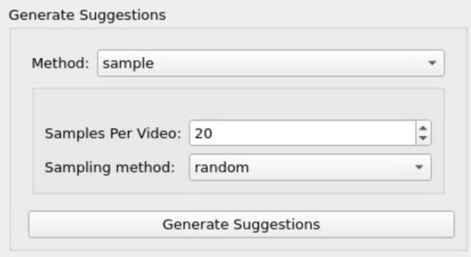
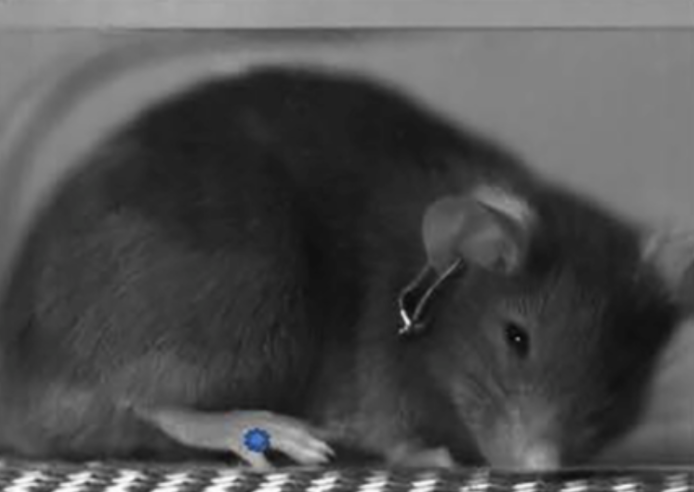
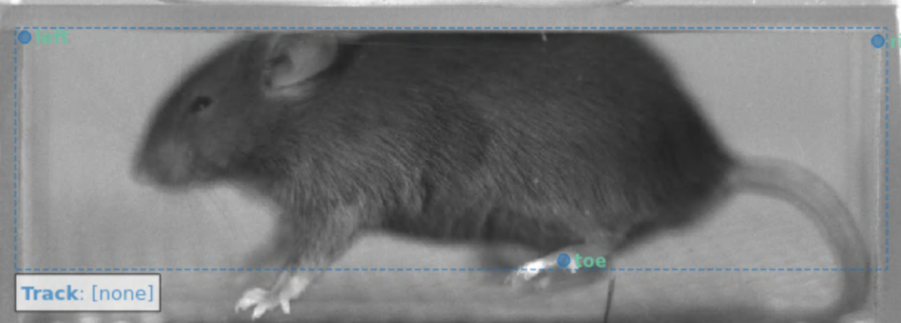

# pain-pipeline

# SOCIAL LEAP: https://sleap.ai/ 

* Paper on its first version - [LEAP](https://www.nature.com/articles/s41592-018-0234-5)
* Paper on [SLEAP](https://www.biorxiv.org/content/10.1101/2020.08.31.276246v1)
* SLEAP [Github](https://github.com/murthylab/sleap)
* Practice/example videos [here](https://upenn.app.box.com/s/oro330k43pnqskss4prdvdzvdtubuin5)

## Set up
Follow along with the tutorial found [here](https://sleap.ai/tutorials/tutorial.html)
First, create a new MATE session in https://rivanna-desktop.hpc.virginia.edu/ 
```bash
# If you are running a training, request an interactive job for 5 hours: 
ijob -A mgowda -t 05:00:00 -p gpu --gres=gpu:p100 
module load anaconda 
module load cudnn/7.6.5.32
```

(1) Set up a conda environment: 
    Only do this once. Skip to step 2 if already done. 
```bash
conda create -n sleapgpu python=3.6 
source activate sleapgpu 
pip install -r sleap-requirements.txt --no-deps
```

(2) Activate environment 
    ```bash
    source activate sleapgpu
    sleap-label &
    ```
* GUI should pop up after a few seconds 
* Drag the top bar of the GUI to make it fit on the FastX screen  

## Usage 
### Add a video  
* File → add videos (mp4, avi, h5 format) 
### Create the skeleton of body parts 
* In the ‘Skeleton’ tab on the right, click New Node
* Double click new_part and name it toe
* “ and name it left 
* “ and name it right 
### Generate suggestions of frames to label
* In the ‘Generate Suggestions’ tab: 
* 
### Label the 20 suggested frames  
* In the ‘Labeling Suggestions’ tab, double click on the first row, which represents the first suggested frame 
* On top bar, press Labels → Add Instance (or just ctrl + i) 
  * Labels that say “toe”, “left”, + “right” should show up on frame
  * Click and drag the label to the center toe, like so: 
  * 
  * Label left and right on the left and right of the chamber like so: 
  * 
* Press Next under ‘Labeling Suggestions’ and repeat the past instructions on the new, unlabeled frame
* Continue until all 20 frames are labeled 
* File → Save
### Run training 
* On top bar, press Predict → Run Training… 
* Training/Inference Pipeline Type: single animal 
* (meaning one animal is in the video) 
```
Sigma for nodes: 5.00
Run Name Prefix: N/A
Runs Folder: models 
Tags: N/A
Best Model: checked (the rest aren’t) 
```
* Predict On: 
  * For the first training, do random frames or suggested frames
  * If you are happy with the predictions from the previous trainings, do entire video
    * After this, skip to last step
    * Do not need to correct frames if entire video is predicted
### Correct the predicted labels 
* Check back before the 5 hours runs out for the interactive job
  * If it’s still running, you should see a graph
  * If it’s done predicting, you will get a message telling you how many frames it was predicted on 
  * **remember to save before the 5 hours runs out**
    * otherwise it will kill the GUI, and all the data will be lost
* Yellow dots (the predictions) will appear on the frames the training was predicted on 
* To find the frames that predictions are on, press Go → Next Suggestion or Next Labeled Frame 
* If the toe was not predicted in the right place, double click it and move it to the correct place 
* Once all the frames have corrected labels, run training again (previous step) 
### After predictions are made on the entire video, yellow dots will be on every frame 
* File → Export Analysis HDF5… 


# PAWS: https://github.com/crtwomey/paws 
* Paper [here](https://elifesciences.org/articles/57258) 
* [Methods paper](https://www.sciencedirect.com/science/article/pii/S2666166721000290) on setup 

## Usage
* Run ```paws.R```
